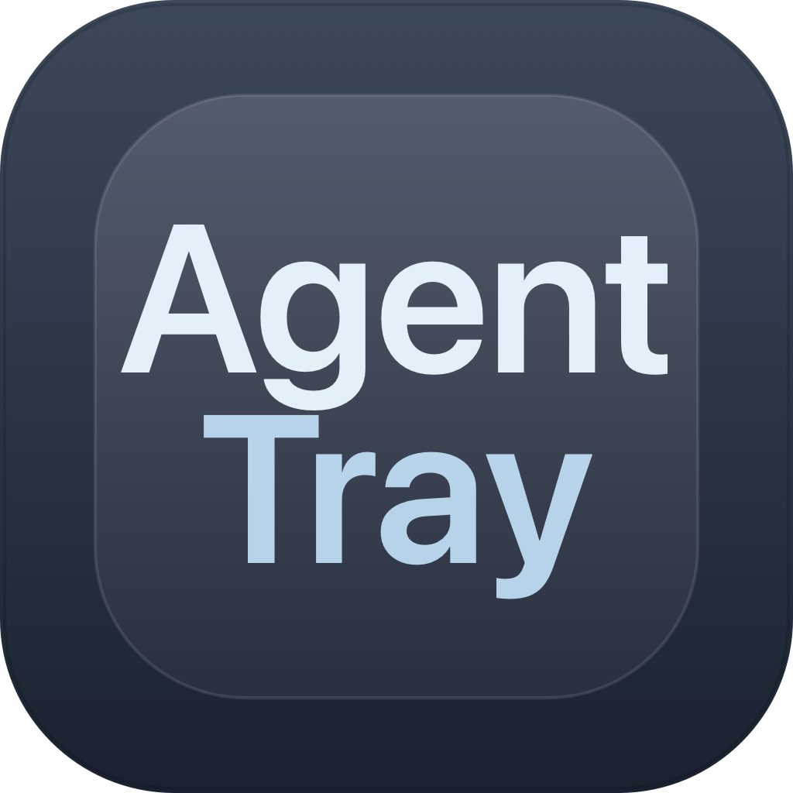

# AgentTray

<p align="center">
  
</p>

<p align="center">
  一个面向 macOS 菜单栏的多 Agent 使用看板。
  <br />
  聚合 Codex、Claude、Gemini 等使用数据，在顶部入口中快速查看配额、活跃趋势、热力图和个性化成长状态。
</p>

## 项目简介

AgentTray 是一个基于 Swift + AppKit/SwiftUI 构建的 macOS 菜单栏应用。它把不同 Agent 的使用情况统一汇总到一个轻量面板里，让你不用频繁切网页或翻日志，就能快速了解：

- 今天聊了多少次
- 总共活跃了多久
- 不同 Agent 的使用趋势
- 最近一周、一个月或一年的活跃热力图
- 当前默认展示 Agent、刷新频率、主题色和热力图配色

## 主要功能

- 多 Agent 视图：支持在 `All / Codex / Claude / Gemini` 之间切换查看。
- 配额与状态概览：展示 5 小时配额、本周余量、对话数、活跃时长与净变更。
- 活跃热力图：支持按周、月、年查看趋势，适合观察长期使用节奏。
- 宠物成长系统：根据活跃数据累计经验，提供更具反馈感的可视化体验。
- 顶部热点入口：可在菜单栏图标之外启用顶部热点，快速展开面板。
- 可配置主题：支持多种主题色与热力图颜色搭配。
- 本地数据源：围绕本机 Codex 环境和多 Agent 数据源读取，无需额外服务端。

## 界面预览

根据当前项目截图，应用主要包含这三类核心界面：

### 1. 多 Agent 总览

- 在统一面板中查看 `All / Codex / Claude` 的聚合状态。
- 左侧展示宠物等级、经验和经验来源。
- 右侧展示当前 Agent 的活跃时长、会话数和 Token 概览。
- 下方以周视图热力图展示跨 Agent 活跃趋势。

### 2. 设置面板

- 支持配置默认展示 Agent。
- 支持配置默认热力图范围和刷新频率。
- 支持开启或关闭顶部热点入口。
- 支持切换主题色与热力图颜色。

### 3. 单 Agent 年度趋势

- 针对单个 Agent 展示更细粒度的配额与状态信息。
- 支持年度热力图，适合观察长期使用强度和阶段性变化。
- 底部可展示当前环境、认证方式和已连接数据源。

## 运行环境

- macOS 14+
- Xcode 16+ 或支持 Swift 6.2 的本地 Swift toolchain

## 本地开发

### 运行测试

```bash
swift test
```

### 构建 App

```bash
./scripts/package_app.sh debug
```

或构建 release 版本：

```bash
./scripts/package_app.sh release
```

构建完成后，产物默认位于：

```bash
dist/AgentTray.app
```

## 项目结构

```text
AppBundle/                     App 图标与 bundle 元数据
Sources/CodexTray/            程序入口
Sources/CodexTrayFeature/     核心业务、视图与数据读取逻辑
Tests/CodexTrayFeatureTests/  单元测试
scripts/                      打包、校验与图标生成脚本
dist/                         本地打包产物
```

## 技术栈

- Swift
- AppKit
- SwiftUI
- Swift Package Manager

## 当前状态

这个项目目前已经具备：

- 本地菜单栏运行能力
- 多 Agent 视图切换
- 热力图与趋势展示
- 设置面板与主题配置
- 自定义应用图标与打包脚本
